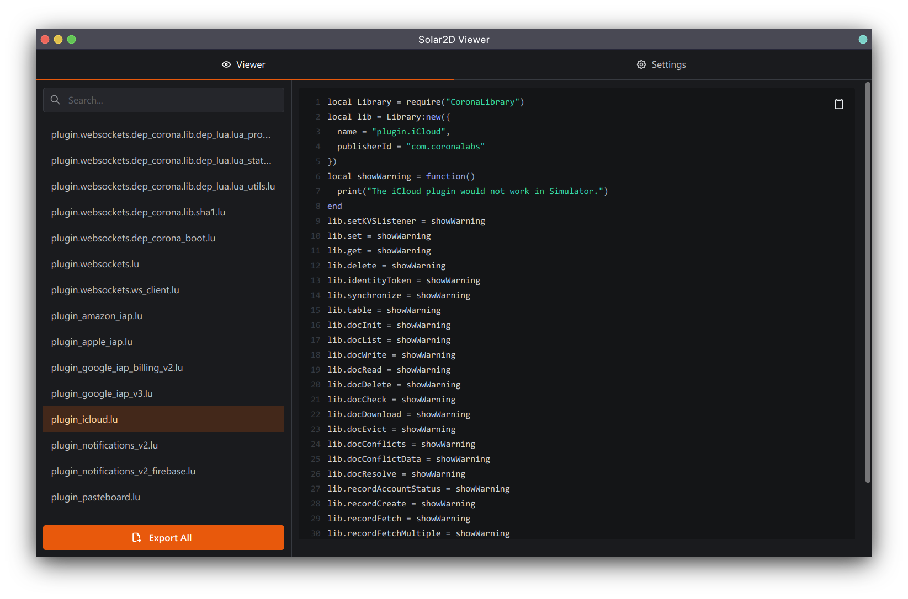

<hr>

<div align="center"> 
    
</div>

<div align="center"> 

Modding Framework for Coromon  

</div>

---

# Introduction

A tool to decompile Solar2D resource files.

# Screenshot



# Requirements

* [unluac](https://sourceforge.net/projects/unluac/files/Unstable/)

# Building

* Clone Repository

* Setup Frontend
  ```bash
  cd interface
  yarn && yarn build
    ```

* Compile
  ```bash
  mkdir build && cd build
  cmake .. && cmake --build . --config Release   
  ```

* Done!